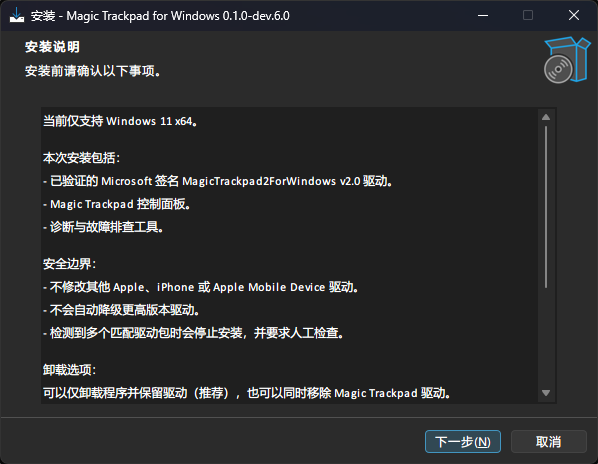
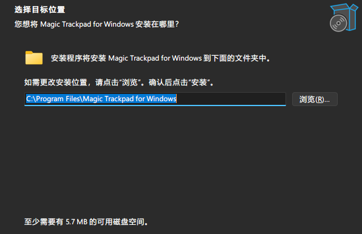
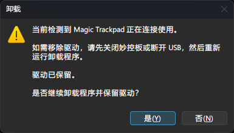

# Magic Trackpad for Windows

[简体中文](README.zh-CN.md)

A Windows 11 installer, diagnostics, and lifecycle-management layer for Apple
Magic Trackpad, built around the Microsoft-signed
[MagicTrackpad2ForWindows](https://github.com/vitoplantamura/MagicTrackpad2ForWindows)
Precision Touchpad driver.

This project does **not** rewrite or re-sign the upstream driver. It focuses on
safe installation, exact Driver Store identification, privacy-aware diagnostics,
and predictable uninstall/reinstall behavior for ordinary Windows users.

> **Development status**
>
> Current source version: `v0.1.0-dev.6.0`.
>
> Last fully validated binary baseline: `v0.1.0-dev.5.4.2`.
>
> No public binary release is published from this repository yet. The wrapper
> `Setup.exe` is currently unsigned; the embedded upstream driver payload remains
> the original Microsoft-signed payload. License/source-distribution tooling,
> contributor workflows, hosted non-destructive CI, and public-repository safety
> controls are in place. `dev.6.0` is the first public-binary prerelease candidate
> line and is not considered validated until its release regression closes.

## Screenshots

| Installation information | Destination folder |
| --- | --- |
|  |  |

Connected-device fail-closed guard:



The installer automatically uses Simplified Chinese on a Simplified Chinese
Windows UI. Unsupported Windows UI languages fall back to English.

## What this project adds

The upstream driver already provides the actual Precision Touchpad support.
This repository adds the surrounding Windows product lifecycle:

- a Windows 11-style bilingual installer;
- exact Driver Store detection instead of generic "Apple" driver searches;
- idempotent install behavior when the expected driver is already current;
- fixed upstream release/hash/signature verification before packaging;
- a small C++ helper for device and driver state;
- Bluetooth `remembered / paired / connected` state detection;
- privacy-minimized diagnostic reports;
- Start-menu shortcuts for the control panel, Windows Touchpad Settings,
  diagnostics, logs, and uninstall;
- safe application-only uninstall that keeps the driver;
- optional driver removal with export-before-delete, backup verification, no
  `/force`, and post-removal verification;
- a connected-device guard that blocks destructive driver removal while the
  trackpad is in use.

## Validated support

The table below describes what **this wrapper project has actually validated**.
It is intentionally narrower than the upstream driver's possible support.

| Area | Project-validated baseline |
| --- | --- |
| Operating system | Windows 11 x64 |
| Hardware | Apple USB-C Magic Trackpad A3120 |
| USB | Validated |
| Bluetooth | Validated |
| Windows Precision Touchpad | Validated |
| Battery reporting | Validated |
| Haptic feedback | Validated |
| Native Windows two/three/four-finger gestures | Validated |
| ARM64 wrapper/install lifecycle | **Not yet validated** |
| Windows 10 wrapper/install lifecycle | **Not claimed by this project** |

The pinned upstream package contains other architecture support, and upstream may
support additional configurations. Do not treat that as project-level validation
until this wrapper has been exercised on the corresponding real hardware/system.

## Installation

A public binary release is not published yet.

`v0.1.0-dev.5.4.2` remains the frozen validated binary baseline and must never be
rebuilt or reissued from post-tag source. The active source version has advanced
to `v0.1.0-dev.6.0` for the first public-binary prerelease candidate. The version
bump alone is not validation; the candidate must still pass the complete release
regression and controlled bundle verification.

The normal user flow is:

1. Run `MagicTrackpad-for-Windows-Setup-<version>-x64.exe`.
2. Review the installation information.
3. Choose the installation folder.
4. Click **Install**.
5. Pair/connect the Magic Trackpad normally through Windows.
6. Configure gestures in **Windows Touchpad Settings**.

If the exact expected driver is already installed and current, Setup uses a
NO-OP Driver Store path instead of adding a duplicate package.

## Uninstallation

The interactive uninstaller offers two choices.

### Remove the application only

This is the default/recommended choice.

It removes the installed application, tools, documentation, and shortcuts while
leaving the Magic Trackpad driver installed.

Silent uninstall is deliberately non-destructive and also keeps the driver.

### Remove the application and Magic Trackpad driver

The safe-removal path:

1. identifies exactly one matching driver package;
2. validates Original INF, provider, and driver version;
3. checks the Magic Trackpad device state;
4. exports the exact package to a timestamped backup;
5. verifies the expected INF/CAT/DLL/SYS files exist in that backup;
6. invokes PnPUtil removal **without `/force`**;
7. re-checks Driver Store state and requires `not-installed`.

If a Magic Trackpad is currently connected, driver removal is blocked before
backup/deletion. The user can disconnect the device and retry, or continue
removing only the application while keeping the driver.

The uninstaller does not search for or delete unrelated Apple, iPhone, Apple
Mobile Device, or Boot Camp drivers.

## Safety model

Several rules are treated as product contracts rather than best-effort behavior:

- published `oemN.inf` names are discovered dynamically and never hard-coded;
- only the exact expected package is eligible for install/removal;
- a newer driver is not silently downgraded;
- ambiguous/multiple matching packages fail closed for manual review;
- the upstream signed payload is deployed byte-for-byte;
- real removal requires a successful backup first;
- `/force` is forbidden in the normal removal path;
- connected devices block destructive removal;
- post-removal verification must report `not-installed`;
- the A3120 `MI_00` interface is not automatically modified as a workaround;
- Bluetooth pairing and Windows gesture preferences are not silently changed.

Detailed evidence is linked from [docs/README.md](docs/README.md).

## Diagnostics and privacy

The Start menu includes **Generate Diagnostic Report**.

`Diagnostics-*.txt` is privacy-minimized by default:

- computer/user names are redacted;
- Bluetooth addresses are redacted;
- machine-specific PnP instance tails are redacted;
- useful stable hardware/driver state is retained.

Raw technical logs such as `Install-*.log`, `DriverRemoval-*.log`, and
`UninstallDecision-*.log` can include local machine information. Review/redact
them before posting publicly.

See [Runtime Log Sharing Policy](docs/RUNTIME_LOG_SHARING_POLICY.md).

## Build from source

### Validated development environment

- Visual Studio Community 2026 / MSVC x64
- Windows SDK 10.0.26100
- CMake 4.3.1 (project minimum: 3.25)
- Inno Setup 6.7.0
- PowerShell 7 for development scripts
- Windows PowerShell 5.1 compatibility for installed runtime scripts

### 1. Build the helper

From the repository root:

```powershell
.\scripts\Build.ps1
```

### 2. Stage the pinned upstream payload

Current pinned upstream release:

- project: `vitoplantamura/MagicTrackpad2ForWindows`
- release: `v2.0`
- asset: `MT2FW11-20260223-MSSigned.zip`
- SHA256:
  `2870c0c7982ce6aafc3ff763fec2999423dc4bdbd1a2c0e31ca216f26a75714f`

```powershell
.\scripts\Prepare-DriverPayload.ps1 `
    -SourceZip "C:\path\to\MT2FW11-20260223-MSSigned.zip"

.\scripts\Verify-DriverPayload.ps1
```

The staged binary payload lives under:

```text
third_party\MagicTrackpad2ForWindows-v2.0\
```

and is intentionally excluded from Git.

### 3. Build the installer

The frozen `v0.1.0-dev.5.4.2` installer must not be rebuilt from post-tag source.
Its validated Setup SHA256 is:

```text
afbe531a5e117820c8643b776b74b82002db27d223366cf07fb390c818aeca04
```

The current source has already advanced to `0.1.0-dev.6.0`, with `VERSION` and
`#define MyAppVersion` in `installer/setup.iss` synchronized. From a clean
committed source state, build the prerelease candidate with:

```powershell
.\scripts\Build-Installer.ps1
```

Output:

```text
out\installer\
```

`Build-Installer.ps1` still fails closed if `VERSION` is set to the frozen
`0.1.0-dev.5.4.2`, while `dev.6.0` is allowed only when `VERSION`/Inno version
identity matches. Payload, installer, uninstall, and license-distribution gates
are re-run before compiling.

For publishable release assets, use the controlled
[release compliance process](docs/oss/RELEASE_COMPLIANCE.md) rather than
uploading the raw Setup executable directly.

## Repository layout

```text
helper/       C++ device/Driver Store helper
installer/    Inno Setup installer resources
scripts/      build, validation, diagnostics, and safe lifecycle scripts
third_party/  metadata/staging instructions for the pinned upstream payload
docs/         contracts, validation evidence, OSS notes, and history
```

Start with [docs/README.md](docs/README.md) for technical documentation.

Historical raw patch notes are preserved under
`docs/history/patch-notes/`; they are evidence, not the current product contract.

## Upstream driver and credits

This wrapper depends on and redistributes an **unmodified** build from:

- [vitoplantamura/MagicTrackpad2ForWindows](https://github.com/vitoplantamura/MagicTrackpad2ForWindows)
- pinned release: `v2.0`

Upstream describes the driver as a Microsoft-signed Windows 11 Precision
Touchpad driver with USB-C, Bluetooth, battery-level, haptic-feedback, and
control-panel support.

The upstream project is itself a fork/continuation of work from
[imbushuo/mac-precision-touchpad](https://github.com/imbushuo/mac-precision-touchpad).

Do not attribute the upstream driver implementation or signing work to this
wrapper project.

## Licensing status

Project-authored wrapper code and original documentation are licensed under the
**MIT License** (`SPDX: MIT`):

- [LICENSE](LICENSE)

The pinned `vitoplantamura/MagicTrackpad2ForWindows` driver/control-panel payload
is third-party software under its upstream **GPLv2** terms and is **not**
relicensed under MIT by this project.

Redistribution material is kept separate and explicit:

- [Third-party notices](THIRD_PARTY_NOTICES.md)
- [GNU GPL version 2 text](licenses/GPL-2.0.txt)
- [Upstream source/build provenance](docs/oss/UPSTREAM_SOURCE_PROVENANCE.md)
- [Release compliance process](docs/oss/RELEASE_COMPLIANCE.md)

Future public binary releases are produced as a binary bundle that contains the
MIT/GPL/third-party/provenance material. The exact upstream corresponding-source
archive and build-workflow snapshot are published alongside that binary bundle.

No public binary release has been published yet.

## Contributing, support, and security

Contributor/reporting workflows are now documented:

- [CONTRIBUTING.md](CONTRIBUTING.md)
- [SUPPORT.md](SUPPORT.md)
- [SECURITY.md](SECURITY.md)
- [AGENTS.md](AGENTS.md)
- [Contributor Workflow and Validation Matrix](docs/oss/CONTRIBUTOR_WORKFLOW.md)

GitHub Issue forms and a pull-request template are included under `.github/`.

A non-destructive GitHub Actions CI workflow is now defined under
`.github/workflows/ci.yml`. It runs repository/license/contributor contracts,
Windows PowerShell 5.1 compatibility checks, static installer safety checks, and
a C++ helper build. The first real GitHub-hosted run is tracked separately from
the local workflow-definition baseline.

## Independence

Magic Trackpad for Windows is an independent community project. It is not
affiliated with or endorsed by Apple Inc. or Microsoft Corporation.
